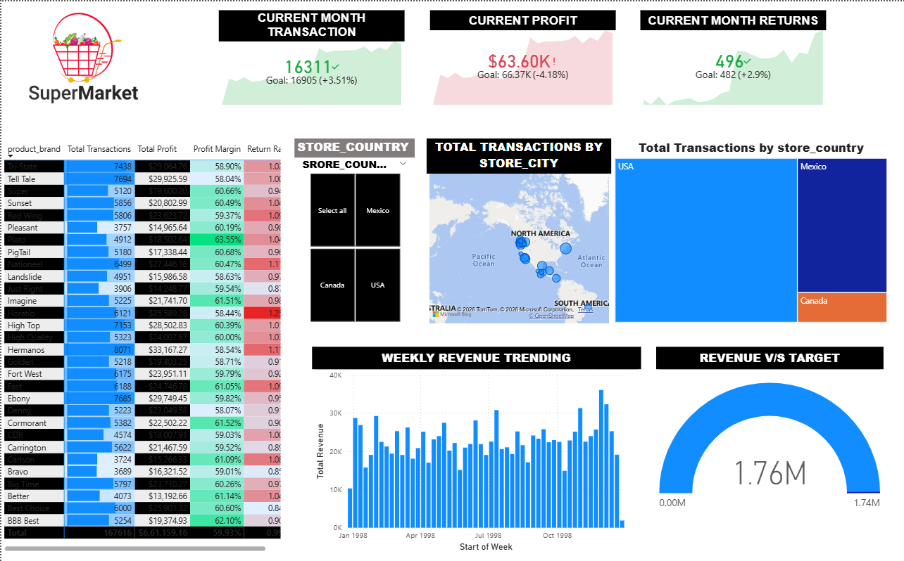

🚀 Interactive sales analytics dashboard built using Power BI

# 🛒 Power BI Supermarket Dashboard

## 📊 Project Overview
This Power BI dashboard analyzes supermarket sales performance using KPIs, Map visualization, Treemap and Revenue tracking.

## 📌 Key Features
- Current Month Transactions KPI
- Profit vs Target Comparison
- Weekly Revenue Trend Analysis
- Store Country Performance
- Revenue vs Target Gauge

## 🛠 Tools Used
- Power BI
- DAX
- Data Modeling

## 📸 Dashboard Preview

